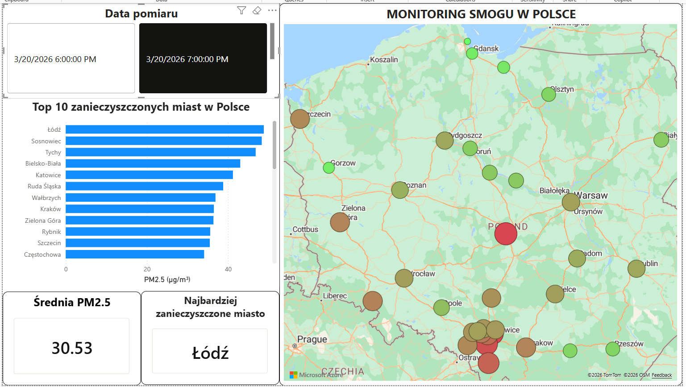

# Poland Air Quality Monitor - End-to-End Data Pipeline

## O projekcie
Projekt to w pełni zautomatyzowany Data Pipeline, który monitoruje jakość powietrza (poziom smogu / PM2.5) w 35 największych miastach w Polsce. Nie ma ręcznego pobierania danych, system samodzielnie łączy się z zewnętrznym API, przetwarza dane i ładuje je do chmurowej relacyjnej bazy danych. Warstwę analityczną stanowi interaktywny dashboard w Power BI.

## Architektura i Przepływ Danych
Projekt realizuje pełen cykl ETL:

1. Extract (API): Skrypt w języku Python pobiera bieżące dane o zanieczyszczeniach (PM2.5, PM10) z Open-Meteo API.
2. Load (Cloud DB): Dane są ładowane do chmurowej bazy danych PostgreSQL (Neon.tech). Zastosowano logikę idempotentności, która zapobiega duplikatom, jeśli proces uruchomi się wielokrotnie dla tej samej godziny.
3. Automatyzacja (CI/CD): Narzędzie GitHub Actions pełni rolę orkiestratora, automatycznie uruchamiając skrypt o wyznaczonych porach, budując historyczną bazę danych bez mojej ingerencji.
4. Wizualizacja (Power BI): Raport w Power BI łączy się bezpośrednio z bazą PostgreSQL, umożliwiając analizę historyczną i w czasie rzeczywistym.

## Dashboard Power BI

